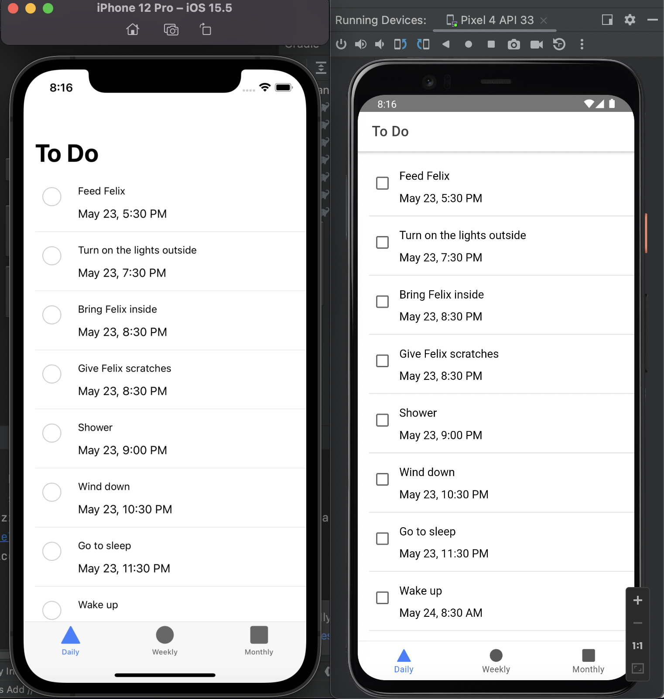

# To-Do-List



---

## Important Commands
```
  // Completes a fresh build of the app
  ionic build
  
  // Adding IOS and Android platforms
  ionic cap add ios
  ionic cap add android
  
  // Run after ionic build or new added plugin
  ionic cap copy
  ionic cap sync
  
  // Open Native IDES
  ionic cap open ios
  ionic cap open android
  
  // Live Reload
  ionic cap run ios -l --external
  ionic cap run android -l --external
```
